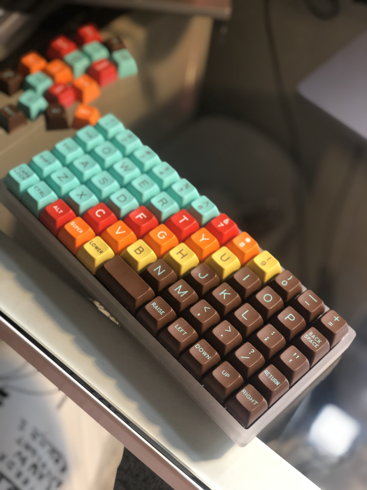

# 💻 Dramatic Development 🎤

The personal blog of [Shane Lonergan](https://shanelonergan.dev). NYC based software engineer, actor, director, and musician. Documenting my journey from the stage to the computer screen.

## Technologies and Styling

- [Gatsby](https://www.gatsbyjs.org/)
- [Gatsby Starter Blog MDX](https://github.com/hagnerd/gatsby-starter-blog-mdx) template
- Custom CSS
- Code Samples
  - [Prism React Renderer](https://github.com/FormidableLabs/prism-react-renderer)
  - [Custom Syntax Theme](./src/themes/1976.js)
- Theme
  - Blog and syntax theme based on the [1976 keycap set](https://pimpmykeyboard.com/sa-1976-keyset-two-shot/)
  - 
- Fonts
  - Code: [Dank Mono](https://dank.sh/)
  - Blog: [Merriweather](https://fonts.google.com/specimen/Merriweather)

